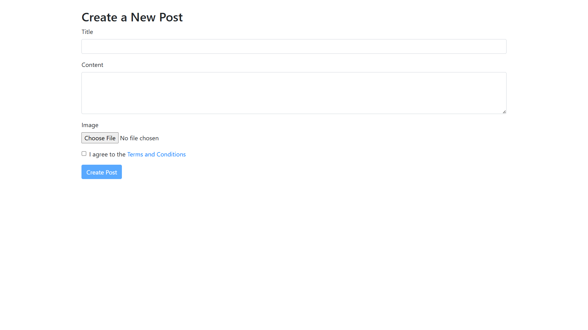

# Blog Management System

## Project Overview
The Blog Management System is a web application built using **Laravel 11** and **PHP 8.2**. It enables users to create, edit, and manage blog posts with an admin and reviewer system for post approval and publishing. The application supports user authentication, role-based access (admin, reviewer, user), and post status management (`pending`, `reviewer_approved`, `published`, `rejected`). It uses **MariaDB** for data storage and **Vite** for asset management.

### Features
- **User Management**: Register, login, and manage user profiles.
- **Role-Based Access**:
  - **Admins**: Manage users, posts, and reviewer requests.
  - **Reviewers**: Approve/reject posts and provide suggestions.
  - **Users**: Create and edit posts.
- **Post Management**: Create, edit, and delete posts with image uploads and status tracking.
- **Caching**: Utilizes Laravel's caching system for performance optimization.
- **Job Queues**: Supports job batching and queue handling for background tasks.
- **Session Management**: Secure session handling for user authentication.
- **Database**: Uses MariaDB with tables for users, posts, cache, jobs, and sessions.

### Tech Stack
- **Backend**: Laravel 11, PHP 8.2
- **Database**: MariaDB 10.4.32
- **Frontend**: Blade templates, Vite for asset bundling
- **Testing**: Supports Pest PHP for testing
- **Others**: Laravel's built-in support for caching, job queues, and migrations

## Screenshots
The following screenshots showcase the application's key interfaces (all in PNG format):
1. **Home**: Homepage of the application.
 
2. **AboutUs1**: First section of the About Us page.

3. **AboutUs2**: Second section of the About Us page.

4. **Register**: User registration page.
 
5. **UserLogin**: User login page.
 
6. **UserDashboard**: Dashboard for regular users to manage their posts.
 
7. **CreatePost**: Form for creating a new blog post.
 
8. **EditPost**: Form for editing an existing blog post.

9. **ReviewerDashboard**: Dashboard for reviewers to manage post approvals.

10. **ReviewerRequest**: Interface for reviewers to request post reviews.

11. **AdminDashboard**: Admin dashboard for managing users and posts.

12. **AdminRequest**: Interface for admins to handle reviewer requests.

13. **PostPDF**: PDF view/export of a blog post.


*Note*: Screenshots are stored in the `screenshots/` directory in the project root.

## Prerequisites
Before setting up the project, ensure you have the following installed:
- **PHP** 8.2 or higher
- **Composer** (for dependency management)
- **MariaDB** 10.4.32 or compatible MySQL version
- **Node.js** and **npm** (for Vite asset compilation)
- **Git** (for cloning the repository)
- **phpMyAdmin** (for database management)
- A web server (e.g., Apache or Nginx) or Laravel's built-in development server

## Installation Steps
Follow these steps to set up and run the project locally:

### 1. Clone the Repository
```bash
git clone https://github.com/Purvarajsinh39/BLOG-MANAGEMENT-SYSTEM-LARAVEL.git
cd blog-management
```

### 2. Install Dependencies
Install PHP dependencies using Composer:
```bash
composer install
```

Install Node.js dependencies for frontend assets:
```bash
npm install
```

### 3. Configure Environment
Copy the `.env.example` file to create a `.env` file:
```bash
cp .env.example .env
```

Update the `.env` file with your database credentials:
```dotenv
DB_CONNECTION=mysql
DB_HOST=127.0.0.1
DB_PORT=3306
DB_DATABASE=blog-management
DB_USERNAME=your_username
DB_PASSWORD=your_password
```

Generate an application key:
```bash
php artisan key:generate
```

### 4. Import the SQL Database
To set up the database, import the provided SQL dump file into phpMyAdmin:

1. Open phpMyAdmin in your browser (e.g., http://localhost/phpmyadmin).
2. Create a new database named `blog-management`.
3. Select the `blog-management` database.
4. Click on the **Import** tab.
5. Choose the SQL dump file (e.g., `blog-management.sql`) from your project directory.
6. Click **Go** to import the database schema and data.

### 5. Run Migrations (Optional)
If you prefer to set up the database using Laravel migrations instead of the SQL dump:
```bash
php artisan migrate
```
Note: If you use the SQL dump, migrations are already applied as per the migrations table.

### 6. Compile Assets
Compile frontend assets using Vite:
```bash
npm run dev
```

For production, use:
```bash
npm run build
```

### 7. Run the Application
Start the Laravel development server:
```bash
php artisan serve
```
The application will be available at [http://localhost:8000](http://localhost:8000).
